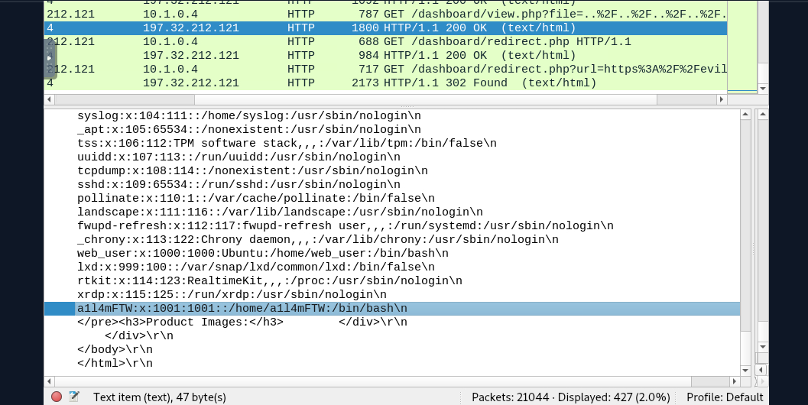

# Malicious Web Traffic Analysis — LETSDEFEND.IO

## Overview
This project involves analyzing suspicious web traffic patterns identified during a cybersecurity investigation. The goal is to determine if there is any malicious activity, identify the vulnerabilities exploited, and provide detailed findings. The analysis was conducted in a Linux Ubuntu environment within the LETSDEFEND cloud instance lab environment.

## Challenge Description
During a cybersecurity investigation, unusual traffic patterns were detected, raising suspicions of a potential attack. The task was to analyze the provided PCAP file and uncover the details of the attack.

## Lab Environment
- **Platform:** LETSDEFEND.IO Cloud Instance
- **Operating System:** Linux Ubuntu
- **Tools Used:**
  - Wireshark for network traffic analysis

## Analysis Process

### 1. **IP Address of the Web Server**
   - **IP Address:** `10.1.0.4`
   - **Methodology:** I filtered traffic on port `tcp.port == 443` to identify the web server.
   - **Screenshot:**  
     

### 2. **IP Address of the Attacker**
   - **IP Address:** `197.32.212.121`
   - **Methodology:** I navigated to `Statistics > Conversations` in Wireshark to identify the most active IP address, which led to the attacker’s IP.
   - **Screenshot:**  
     

### 3. **Name of Vulnerability Exploited**
   - **Vulnerability:** XML External Entity (XXE)
   - **Details:** The attacker exploited a vulnerability in the XML parser of the web server by sending a malicious payload through a POST request to the registration page (`/register/register.php`). This allowed the attacker to gain sensitive information.
   - **Screenshot:**  
     

### 4. **Note in the Source Code**
   - **Note:** `yougotme`
   - **Details:** The attacker decoded base64 content from the server's response, revealing a comment in the source code indicating a secure password update.
   - **Screenshot:**  
     

### 5. **Bruteforced Username and Password**
   - **Username:** `admin`
   - **Password:** `Fernando`
   - **Details:** The attacker successfully brute-forced the credentials and gained admin access.
   - **Screenshot:**  
     

### 6. **Directory Traversal Exploit**
   - **Payload:** `../../../../../../../../../../../../../../../etc/passwd`
   - **Details:** After gaining admin access, the attacker exploited a directory traversal vulnerability to access sensitive server files.
   - **Screenshot:**  
     

### 7. **Last User Account Viewed**
   - **Username:** `a1l4mFTW`
   - **Details:** The attacker identified the last user created on the server by viewing the `/etc/passwd` file.
   - **Screenshot:**  
     

### 8. **Open Redirect Vulnerability**
   - **URL Tested:** `https://evil.com/`
   - **Details:** The attacker exploited an open redirect vulnerability, redirecting users to a malicious site, potentially leading to phishing attacks.
   - **Screenshot:**  
     

## Conclusion
This project highlights the importance of thorough traffic analysis in detecting and mitigating web-based attacks. The vulnerabilities exploited in this challenge—such as XXE and directory traversal—underline the need for secure coding practices and vigilant network monitoring.

## Author
- Ryan Wachira

## License
- MIT License
